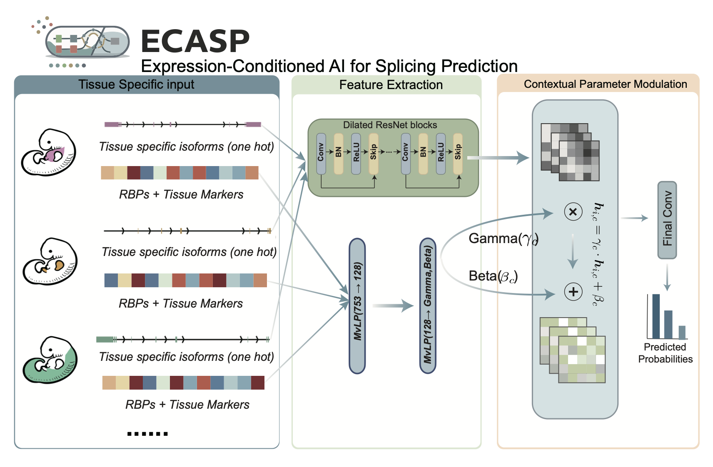

<p align="center">
  
</p>
ECASP（Expression-Conditioned AI for Splicing Prediction）是在 PyTorch 中重构和扩展的剪接预测框架，实现了从原始基因组数据到剪接位点预测/变异注释的全流程。本指南按当前 methods 中采用的两阶段训练主线组织：先在多个 developmental systems 上联合训练 ECASP（保留 FiLM 条件分支），再冻结 FiLM，使用 reference dataset 在零向量条件下微调 sequence backbone；最终在推理和 variant 注释阶段重新输入目标 system 的真实表达向量，从而得到 system-specific prediction。

## Quick Start

如果你只是想先快速跑通推理，而不是从头训练模型，可以直接使用仓库已附带的二阶段 ECASP checkpoint [`checkpoints/ecasp_stage2_model_best.pt`](checkpoints/ecasp_stage2_model_best.pt) 和现成的 system 条件向量 [`data/blood_features.json`](data/blood_features.json)。

1. 安装：

```bash
pip install -e .
ecasp --help
```

2. 直接运行 variant 注释：

```bash
ecasp variant \
  --input /path/input.vcf \
  --output /path/output_annotated.vcf \
  --model checkpoints/ecasp_stage2_model_best.pt \
  --ref-genome /path/genome.fa \
  --annotation data/grch38_chr.txt \
  --flanking-size 10000 \
  --rbp-expression data/blood_features.json
```

3. 查看该 system 背景下的 RBP/HVG 梯度或 contribution：

```bash
ecasp gradient-rbp-attribution \
  --variant 'chr17:28369751:G>GC' \
  --gene VTN \
  --model checkpoints/ecasp_stage2_model_best.pt \
  --ref-genome /path/genome.fa \
  --annotation data/grch38_chr.txt \
  --flanking-size 10000 \
  --rbp-expression data/blood_features.json \
  --film-strengths 1 \
  --target DS_AG \
  --rank-metric gradxinput \
  --top-k 20 \
  --output /path/vtn_blood_rbp_gradient.tsv
```

如果要和 reference-only 基线比较，只需把 `--model` 切换为 [`checkpoints/spliceai_reference_baseline_model_best.pt`](checkpoints/spliceai_reference_baseline_model_best.pt)。

如果你想换成别的 developmental system，再使用 `ecasp prepare-rbp-expression` 从 [`data/tissue_expression_features_scaled.csv`](data/tissue_expression_features_scaled.csv) 导出对应 JSON 即可。

---

## 目录

- [环境与资源](#resources)
- [完整流程概览](#workflow-overview)
- [生成 HDF5 数据 (`create-data`)](#create-data)
- [生成条件向量 (`prepare-rbp-expression`)](#prepare-rbp-expression)
- [第一阶段：多组织联合训练 (`train`)](#train)
- [第二阶段：冻结 FiLM 并用 reference data 微调 backbone (`transfer`)](#transfer)
- [Variant 注释 (`variant`)](#variant)
- [RBP 梯度 / contribution 分析](#gradient-rbp-attribution)

---

<a id="resources"></a>
## 环境与资源

- **依赖**：Python ≥ 3.10、PyTorch（GPU 训练建议 CUDA≥11.7）、NumPy/Pandas/HDF5/pyfaidx 等；执行 `pip install -e .` 会自动安装需要的 Python 包。
- **硬件**：基础模型/FiLM 微调建议使用至少 16GB GPU；Variant 注释可在 CPU 上运行但会较慢。
- **基础数据**：
  - 参考基因组 FASTA（例：`data/genome.fa` + `.fai`）。
  - 组织/物种对应的 GTF/GFF 注释文件。仓库提供了一个示例 developmental-system 注释文件 [`data/tissue_gff3/blood.gff3`](data/tissue_gff3/blood.gff3)。
  - SpliceAI 官方 annotation（示例：`data/grch38.txt`）或自定义注释。
  - 组织表达矩阵：已拼接且标准化的 RBP+HVG 矩阵，如 [`data/tissue_expression_features_scaled.csv`](data/tissue_expression_features_scaled.csv)。
  - 现成的 system 条件向量示例：[`data/blood_features.json`](data/blood_features.json)。
  - 轻量级 checkpoint：仓库已附带最终二阶段 ECASP 模型 [`checkpoints/ecasp_stage2_model_best.pt`](checkpoints/ecasp_stage2_model_best.pt) 和基线比较模型 [`checkpoints/spliceai_reference_baseline_model_best.pt`](checkpoints/spliceai_reference_baseline_model_best.pt)。

安装完成后可用下列命令快速检查：

```bash
pip install -e .
ecasp --help
```

---

<a id="workflow-overview"></a>
## 完整流程概览

- **create-data**：分别准备 reference dataset 和多 developmental systems 的 HDF5 数据集（训练/验证/测试）。
- **prepare-rbp-expression**：为每个 developmental system 生成条件向量（RBP + HVG），并准备 reference fine-tuning 所需的零向量。
- **train**：第一阶段，在多个 developmental systems 上联合训练 ECASP，FiLM 与 backbone 一起学习。
- **transfer**：第二阶段，以第一阶段最佳 checkpoint 为起点，冻结 FiLM，在 reference dataset 上微调非 FiLM 参数。
- **variant**：使用第二阶段最终模型 + 目标 system 条件向量，对 VCF 做 system-specific 剪接影响注释。

以下章节将详细说明每一步。

---

<a id="create-data"></a>
## 生成 HDF5 数据 (`create-data`)

`create-data` 会执行两件事：1) `create_datafile` 将注释切成序列窗口；2) `create_dataset` 输出 HDF5 分片。典型命令：

```bash
ecasp create-data \
  --annotation-gff data/tissue_gff3/blood.gff3 \
  --genome-fasta data/genome.fa \
  --output-dir /path/dataset_blood \
  --parse-type canonical \
  --biotype protein-coding \
  --chr-split train-test \
  --split-method human \
  --split-ratio 0.8 \
  --val_split_ratio 0.1 \
  --flanking-size 10000 \
  --verify-h5 \
  --remove-paralogs \
  --min-identity 0.8 \
  --min-coverage 0.5
```
仓库内提供了一个用于演示 `create-data` 的示例 GFF3 注释文件 [`data/tissue_gff3/blood.gff3`](data/tissue_gff3/blood.gff3)。若要复现论文中的多系统训练，请自行准备其他 developmental systems 的注释文件。
---

<a id="prepare-rbp-expression"></a>
## 生成条件向量 (`prepare-rbp-expression`)

在进入第一阶段多组织联合训练之前，需要先为每个 developmental system 准备条件向量。实际配置格式可参考 [`config/developmental_systems.example.json`](config/developmental_systems.example.json)；其中引用的 `data/blood_features.json`、`data/neuron_features.json` 这类文件，都是通过 `ecasp prepare-rbp-expression` 从共享表达矩阵导出的。

现在直接使用单个矩阵（已包含 RBP + HVG，且已标准化）例如 [`data/tissue_expression_features_scaled.csv`](data/tissue_expression_features_scaled.csv)，行是组织名、列是特征名。以 `blood_features.json` 为例，运行：

```bash
ecasp prepare-rbp-expression \
  --matrix data/tissue_expression_features_scaled.csv \
  --tissue blood \
  --output data/blood_features.json \
  --format json \
  --standardize none
```

其他系统同理，此外，第二阶段 reference fine-tuning 需要“中性条件”输入。仓库已提供 [`data/zero_rbp_features.json`](data/zero_rbp_features.json) / [`data/zero_rbp_features.npy`](data/zero_rbp_features.npy) 作为零向量，可直接用于这一阶段。

---

<a id="train"></a>
## 第一阶段：多组织联合训练 (`train`)

完成各 system 的条件向量准备后，即可在多个 developmental systems 上联合训练 ECASP。每个 system 提供独立的 train/validation/test HDF5 与对应条件向量；训练时通过 `--tissue-config` 以 virtual mixed-batch 方式混合各 system 的 mini-batch，并共享同一套 sequence backbone 与 FiLM 分支。

`--tissue-config` 的示例配置见 [`config/developmental_systems.example.json`](config/developmental_systems.example.json)。

示例命令：

```bash
ecasp train \
  --tissue-config config/developmental_systems.json \
  --flanking-size 10000 \
  --epochs 20 \
  --lr 1e-4 \
  --film-lr-mult 1.0 \
  --scheduler CosineAnnealingWarmRestarts \
  --loss focal_loss \
  --focal-alpha 0.2 1.0 1.0 \
  --focal-gamma 2.0 \
  --output-dir runs/stage1_multisystem \
  --project-name ecasp_stage1 \
  --random-seed 42
```

**提示**：

- `--tissue-config` 中每个条目都要提供 train/valid/test HDF5 与对应 `rbp_expression`；所有向量的维度与特征顺序必须一致。
- 该阶段 FiLM 处于启用状态，`--film-lr-mult 1.0` 表示 FiLM 与 backbone 一起训练。
- 若要贴近 methods，可使用 15 个 developmental systems、20 个 epoch、focal loss 和 cosine warm restart。
- 第一阶段输出的 `runs/stage1_multisystem/model_best.pt` 是第二阶段 reference fine-tuning 的初始化 checkpoint。

---

<a id="transfer"></a>
## 第二阶段：冻结 FiLM 并用 reference data 微调 backbone (`transfer`)

当前 methods 中的第二阶段以上一步最佳 checkpoint 为起点，在 reference dataset 上继续训练。关键点有两个：1）条件输入改为零向量，使这一阶段对应“中性条件”；2）FiLM 分支学习率乘子设为 0，只更新非 FiLM 参数，从而实现“冻结 FiLM、微调 backbone/head”。

示例命令：

```bash
ecasp transfer \
  --train-dataset /path/reference/dataset_train.h5 \
  --test-dataset /path/reference/dataset_test.h5 \
  --pretrained-model runs/stage1_multisystem/model_best.pt \
  --flanking-size 10000 \
  --epochs 20 \
  --lr 1e-4 \
  --scheduler CosineAnnealingWarmRestarts \
  --rbp-expression data/zero_rbp_features.json \
  --film-lr-mult 0.0 \
  --unfreeze-all \
  --output-dir runs/stage2_reference \
  --project-name ecasp_stage2_reference
```

**关键说明**：

- `--pretrained-model` 使用第一阶段多组织联合训练得到的最佳 checkpoint。
- `--rbp-expression data/zero_rbp_features.json` 提供 reference fine-tuning 所需的零向量输入，对应 methods 中的 neutral condition。
- `--film-lr-mult 0.0` 会将 FiLM 分支学习率降为 0，从而冻结 FiLM；`--unfreeze-all` 允许其余非 FiLM 参数继续训练。
- 与 `train` 相同，`train-dataset` 名称中包含 `train` 即可，程序会自动在同目录定位 `dataset_validation.h5`。
- 第二阶段输出的 `runs/stage2_reference/model_best.pt` 是后续 `variant` 和梯度分析推荐使用的最终模型；仓库中已随附对应导出版本 [`checkpoints/ecasp_stage2_model_best.pt`](checkpoints/ecasp_stage2_model_best.pt) 供直接推理。
- 与 reference-only 基线比较时，可使用 [`checkpoints/spliceai_reference_baseline_model_best.pt`](checkpoints/spliceai_reference_baseline_model_best.pt)。

代码层面仍支持单组织 transfer 或其他冻结策略，但若要与论文 methods 保持一致，应优先采用“第一阶段多组织联合训练 + 第二阶段冻结 FiLM、reference fine-tuning”这条主线。

---

<a id="variant"></a>
## Variant 注释 (`variant`)

最后，将 VCF 输入组织特异模型即可得到 delta 分数和剪接位点位移：

```bash
ecasp variant \
  --input /path/input.vcf \
  --output results/annotated_neuron.vcf \
  --model checkpoints/ecasp_stage2_model_best.pt \
  --ref-genome data/genome.fa \
  --annotation data/grch38_chr.txt \
  --flanking-size 10000 \
  --rbp-expression data/neuron_features.json
```

**注意**：

- 若 checkpoint 包含 FiLM/条件元数据，`variant` 会检查输入向量维度与名称；缺失或顺序错误会直接报错，避免预测偏差。
- 复现本文分析时，推荐始终使用第二阶段最终 checkpoint，仅替换 `--rbp-expression` 以切换不同 developmental system；由于 checkpoint 相同，分数可直接跨系统比较。

---

<a id="gradient-rbp-attribution"></a>
## RBP 梯度 / contribution 分析

若希望查看单个变异在给定 developmental system 背景下的条件输入梯度，可使用 `ecasp gradient-rbp-attribution`。其实现位于 [`ecasp/scripts/gradient_rbp_attribution.py`](ecasp/scripts/gradient_rbp_attribution.py)。下面的命令会对指定变异计算 RBP/HVG 特征的梯度，并将结果写成 TSV：

```bash
ecasp gradient-rbp-attribution \
  --variant 'chr17:28369751:G>GC' \
  --gene VTN \
  --model checkpoints/ecasp_stage2_model_best.pt \
  --ref-genome /path/genome.fa \
  --annotation data/grch38_chr.txt \
  --flanking-size 10000 \
  --rbp-expression data/blood_features.json \
  --film-strengths 1 \
  --target DS_AG \
  --rank-metric grad \
  --top-k 20 \
  --output results/vtn_blood_rbp_gradient.tsv
```

说明：

- `--rank-metric grad` 用于查看原始梯度；若要按论文中的 contribution score 排序，可改为默认的 `--rank-metric gradxinput`。
- 脚本输出同时包含 `grad` 和 `grad_x_input` 两列，因此一条命令即可同时查看梯度和 contribution。
- 若要与论文中的 curated RBP 分析保持一致，可额外传入 `--rbp-only --rbp-list data/final_RBP_gene_names.txt`，仅保留仓库附带的 curated RBP 集合，见 [`data/final_RBP_gene_names.txt`](data/final_RBP_gene_names.txt)。
